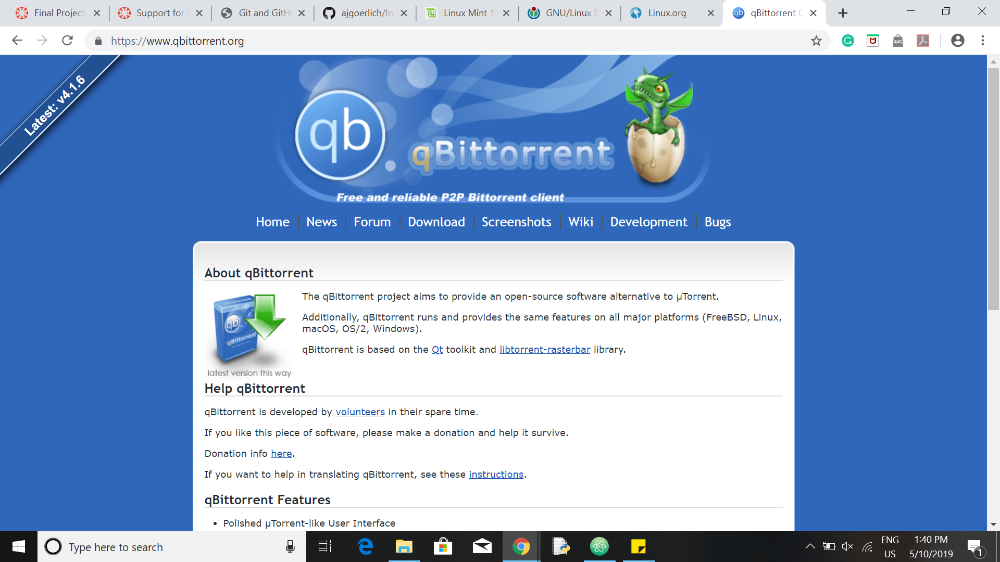
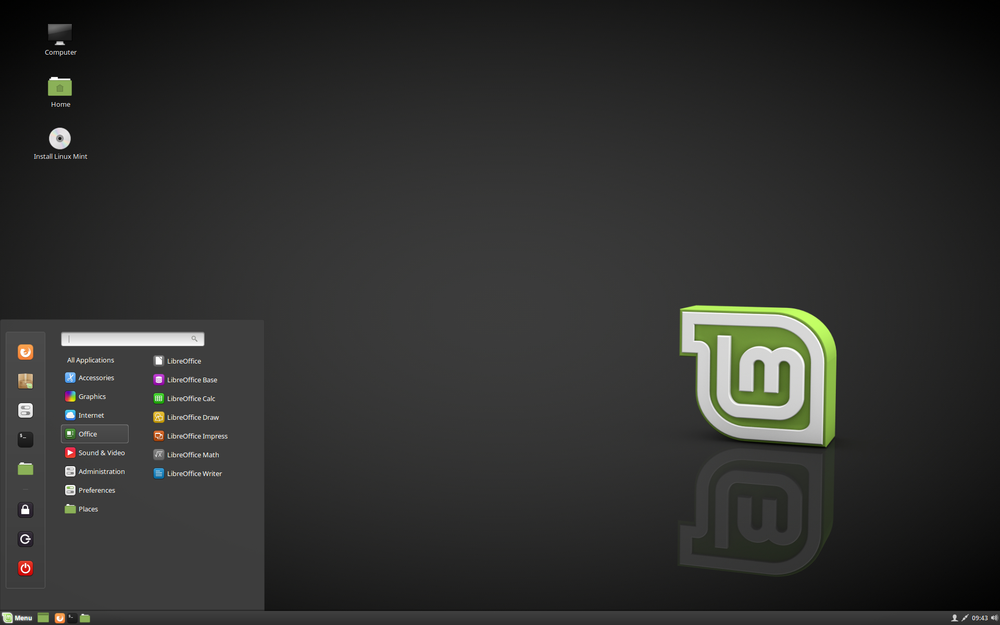

# Tutorial: Installing Linux

[*Click here to go to the introduction*](README.md)

Welcome to my final project for IT 2600, **Installing Linux**! In this tutorial, we will be looking first at what Linux is, followed by how we can actually download/ install Linux (Linux Mint in this case) for personal use. While this challenge is titled **Installing Linux**, you will not need to actually install Linux onto your computer to complete the challenge (although you can if you want; it can be installed alongside other operating systems if you wish). You will have the opportunity to run Linux from a flash drive, and will be able to complete the challenge that way.

### What is Linux?
According to Wikipedia, "Linux is a family of open source Unix-like operating systems based on the Linux kernel, an operating system kernel first released on September 17, 1991 by Linus Torvalds. Linux is typically packaged in a Linux distribution (or distro for short)."

Read: <https://en.wikipedia.org/wiki/Linux>

[Linux.org](https://www.linux.org/) is a very useful resource to look into for more information as well. You can download other distros from this site, as well as find more tutorials to help you further your Linux skills.

There are a very large number of Linux distros that people, both individuals and teams, have created since the creation of Linux. Below is a graphic showing just how many distros have been created to date:

As you can see from the image, some distros actually branch other distros over time, which can (and have in some cases) branch even *more* distros, in an almost never-ending cycle.

### How do I get Linux?
That's the whole point of this tutorial. ;) We are going to be looking at a certain distro of Linux known as Mint. Mint is based on the Ubuntu distro, another highly popular distro. Ubuntu, in turn, is based on Debian Linux, one of the original Linux distros. I personally like Mint because it is relatively light on your computer (I run it on a six-year-old laptop that wouldn't run Windows 7 anymore), especially depending on which version of Mint you choose to run. Mint also has excellent documentation, helping you get up and running faster and easier.

#### Step 1: linuxmint.com
We start the process by going to the official Mint website, <https://www.linuxmint.com/>. Here, we find a number of useful tabs to look through, including links to download Mint, go through the documentation, learn about the team behind Mint and other information about the distro, and more. Take a few minutes (or longer) to look around the site and get a feel for the Mint project.

#### Step 2: Preparing to Download
Once you have taken some time to look over the Mint website, we continue by preparing to download a copy of Mint. In order to do this, you will need a USB flash drive (it **MUST** be empty, or you will lose all data on the drive) and an internet connection (note that this may not work on TigerWiFi, for students on campus).

Click on the "Download" tab on the home page of the website. This takes you to the main page of the current release of the distro, in my case, 19.1 Tessa. This page gives you several options. You can read the documentation for this version of the distro, read the release notes, or download one of six variations of the distro. The differences between them are what architecture they will run on and what desktop loads with the distro. As long as your computer was produced after 2007, the 64-bit editions will work just fine on your computer. As for which desktop to get, that is your decision. The website lists the desktops in order of resource usage, most to least. Cinammon is the most resource-intensive, followed by MATE and finally Xfce. For this tutorial, I will download the 64-bit Cinnamon edition. The process is identical for each edition.

#### Step 3: qBittorrent
The last thing needed in order to download Mint (the way I am showing you) is a way to download torrent files. Downloading torrent files is a fast way to download files (as long as you do so legally). For this we will be using qBittorrent. Start by going to <https://www.qbittorrent.org/> and click on the "Download" tab.

Find the correct link for the OS your computer runs on (Windows 10 in my case) and click the download link. You should be taken to <https://www.fosshub.com/qBittorrent.html>, where you will again find the operating system you are using and click the associated download button.

Once the installer has downloaded, click on the installer to start it. If it asks for permission or warns that it is dangerous, accept it anyway. qBittorrent will not harm your computer. Go through the installation procedure (it's fairly simple). It will list several things you may want to install. Accept all of them (opening torrent files, opening magnet links, and the FireWall rule). The Desktop shortcut and Start Menu shortcut (in the case of Windows 10) are your choice.

#### Step 4: Download!
We are finally ready to download Mint! Now that we have qBittorrent downloaded, we can download the torrent of Mint 19.1. Click the "Torrent" button on the "Download" page of the edition of Mint you chose in the previous step. Your computer will either ask you what program you want to use to open the file or automatically open in qBittorrent. Either way, you want to open the file in qBittorrent. As long as you open it on a network that isn't TigerWiFi, the torrent should automatically download.

#### Step 5: Flash Drive
Now that Mint is downloaded to your computer, we need a way to actually get the software to run. For this, we will create a bootable flash drive. You will (obviously) need to find a flash drive for this to work. Make sure it has at least a couple gigabytes of storage on it. You should really use an extra flash drive for this purpose, and not one you may want to use again (although reusing bootable flash drives is possible). Make sure any important files have been copied off of the drive, as they will be deleted. Next, we will download another piece of software, which we will use to flash the .iso file of Mint onto the flash drive. For this we will use balenaEtcher. Go to <https://www.balena.io/etcher>. You should see a download button on the main page. Click it, and follow the steps to download balenaEtcher.

Insert your flash drive into your computer. Etcher will ask you to select the .iso image you want to flash. Navigate to the Mint .iso file (it should be labeled something similar to "*linux-mint-19.1-cinnamon-64bit.iso*", depending on which edition you initially downloaded) and select it. It will then have you select the drive you want to flash the image to. Select your flash drive and hit the "Flash!" button. Etcher will take a minute, and once finished, you're ready to try Linux!

*Note that in this image, I did not actually click the "Flash" button to show the .iso image being flashed by balenaEtcher, as the only flash drive I had on hand while making this was the flash drive I keep all of my important items on, and I did not want them to be deleted. Keep that in mind when you flash OS images to a flash drive: anything on the drive has the potential to be deleted during the process.*

#### Step 6: Linux!
In order to actually test Linux, you need to be able to run it on your computer. This will be done with the bootable flash drive created in the last step. To do this, you will need to reboot your computer with the bootable drive. Start by inserting the flash drive into your computer (if you removed it after the previous step). Now restart your computer (it might help if you follow this tutorial on a separate computer from the one you test Linux on ;) ). Before your computer boots back into its standard OS, you need to hit the key your computer uses to load the BIOS loading screen. You will hear a beep as your computer restarts; this is when you should hit the key. What key your computer uses as the BIOS key depends on what computer you use. From the Mint documentation, "Depending on the BIOS, these special keys can be Escape, F1, F2, F8, F10, F11, F12, or Delete. That information is usually briefly written on the screen during the boot sequence. On Macs, keep your finger pressed on the Alt or Option key after hearing the boot sound." Your computer should then show a screen asking which device to load the OS from: select your flash drive with the Mint OS. You should then see this screen (all pictures from this point on come from the Mint documentation):

Once Mint boots, you should see this screen (or something similar, depending on your edition):

This is known as a live session. While you are in fact running your computer on Linux at this point, Linux is being run from your flash drive, and so some actions might perform slower than they would in an actual installation of the OS. You also cannot save any changes you make or work you do while in the live session, nor do all programs work in the live session. It exists purely for you to get a feel for the OS.

I encourage you to explore Mint in this configuration to get a feel for the basics of Linux (especially if you do not plan on installing Linux on your machine).

#### Step 7: Install (Optional)
This step is purely optional, and as such, it will not be discussed at much length here. I do not suggest installing Mint on a computer that you use for schoolwork, unless you already have experience with Linux. However, if you choose to install Linux, the Mint documentation has a very nice, concise step-by-step process detailed [here](https://linuxmint-installation-guide.readthedocs.io/en/latest/install.html#installing-linux-mint-on-the-computer).

### Troubleshooting
If you have any issues while downloading/installing Linux Mint (or following this tutorial), the [Mint documentation](https://linuxmint-installation-guide.readthedocs.io/en/latest/index.html) is a very helpful resource. It covers step-by-step the same things I have discussed here.
